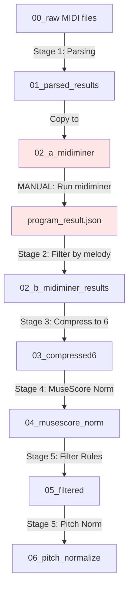
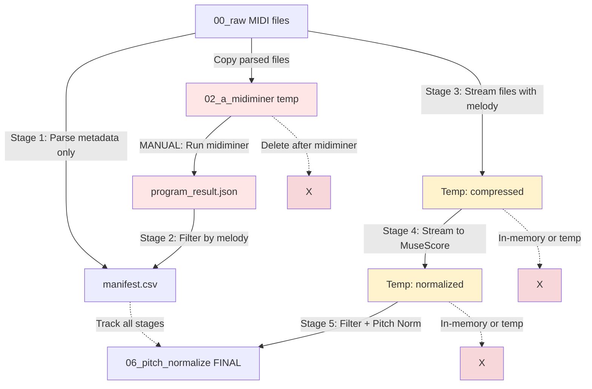

# MuseFormer Preprocessing Pipeline Implementation Plan

## Overview

This plan outlines the creation of a unified preprocessing pipeline for MuseFormer data that combines 5 distinct filtering stages. The pipeline will process raw MIDI files through parsing, melody detection, instrument compression, MuseScore normalization, and filtering/pitch normalization stages.

## Background

The current preprocessing workflow is fragmented across multiple Jupyter notebooks and scripts:
- **Stage 1 (Parsing)**: Implemented in notebook - parses MIDI with miditoolkit, creates manifest
- **Stage 2 (Midiminer)**: Separate environment required - detects melody tracks
- **Stage 3 (Compression)**: Implemented in notebook - compresses to 6 instrument categories
- **Stage 4 (MuseScore Norm)**: Bash script - normalizes MIDI using MuseScore AppImage
- **Stage 5 (Filtering)**: Python script - applies MuseFormer paper filtering rules + pitch normalization

The goal is to create a cohesive pipeline that automates stages 1, 3, 4, and 5, while allowing manual execution of stage 2 (midiminer) as a separate step.

## Storage Efficiency Strategy

> [!IMPORTANT]
> **170k Files Challenge**: With ~170k MIDI files in the full dataset, storing every intermediate stage would consume excessive disk space (potentially 1TB+). The revised approach minimizes intermediate storage.

### Optimized Storage Approach

**What to Keep**:
- `00_raw/` - Original files (required)
- `02_a_midiminer/` - Temporary, deleted after midiminer runs
- `02_b_midiminer_results/` - Only melody files (~60-70% of originals), **deleted after Stage 3**
- `06_pitch_normalize/` - Final output only (~30-50% of originals after filtering)
- `manifest.csv` - Complete processing history

**What to Skip** (in-memory processing):
- `01_parsed_results/` - Parse metadata only, don't copy files
- `03_compressed6/` - Process directly to Stage 4 (in-memory or temp files)
- `04_musescore_norm/` - Process directly to Stage 5 (in-memory or temp files)
- `05_filtered/` - Skip, go directly to pitch normalization

### Processing Modes

The pipeline will support two modes:

**1. Development Mode** (`--mode dev`):
- Keeps all intermediate files (current waterfall structure)
- Used for testing, debugging, and small samples
- Default for datasets < 5000 files

**2. Production Mode** (`--mode prod`):
- Minimal intermediate storage
- Streaming/in-place processing where possible
- Automatic cleanup of temporary files
- Default for datasets ≥ 5000 files

## User Review Required

> [!IMPORTANT]
> **Manual Midiminer Step**: The midiminer stage (Step 2) requires a separate conda environment and will remain a manual step. The pipeline will be designed to pause after Stage 1, allow manual midiminer execution, then resume from Stage 3.

> [!IMPORTANT]
> **MuseScore Environment**: Stage 4 requires specific environment variables and the MuseScore AppImage. The pipeline will need to handle these dependencies correctly.

## Proposed Changes

### Component 1: Core Pipeline Script

#### [NEW] [pipeline_main.py](file:///scratch1/e20-fyp-xlstm-music-generation/e20fyptemp1/fyp-musicgen/scripts/museformer-preprocess/pipeline_main.py)

Main orchestrator script that:
- Provides CLI interface for running individual stages or the full pipeline
- Manages data flow between stages via manifest CSV
- Handles stage dependencies and validation
- Provides progress tracking and logging
- Supports resume capability (skip already-processed files)
- **Supports dev/prod modes** for storage efficiency

**Key features**:
```python
# CLI interface
python pipeline_main.py --stage all --mode prod  # Production: streaming, minimal storage
python pipeline_main.py --stage all --mode dev   # Development: keep all intermediates
python pipeline_main.py --stage 1                # Run only parsing
python pipeline_main.py --stage 3-5 --mode prod  # Run stages 3-5 in streaming mode
python pipeline_main.py --config custom_config.py  # Use custom config
```

---

### Component 2: Stage Implementations

#### [NEW] [stage_01_parsing.py](file:///scratch1/e20-fyp-xlstm-music-generation/e20fyptemp1/fyp-musicgen/scripts/museformer-preprocess/stage_01_parsing.py)

Extracts code from notebook cells to create standalone parsing module:
- Discovers MIDI files in raw directory
- Parses with miditoolkit to extract metadata
- Creates/updates manifest CSV with file statistics
- **Dev mode**: Copies successfully parsed files to `01_parsed_results/`
- **Prod mode**: Only updates manifest, no file copying

**Input**: Raw MIDI files in `00_raw/`  
**Output**: Updated manifest (+ `01_parsed_results/` in dev mode)

---

#### [NEW] [stage_02_midiminer_helper.py](file:///scratch1/e20-fyp-xlstm-music-generation/e20fyptemp1/fyp-musicgen/scripts/museformer-preprocess/stage_02_midiminer_helper.py)

Helper script to prepare for and process midiminer results:
- **Pre-midiminer**: Copies parsed files to `02_a_midiminer/` directory
- **Post-midiminer**: Reads `program_result.json`, filters files with melody, copies to `02_b_midiminer_results/`
- Updates manifest with midiminer metadata

**Manual step**: User must activate midiminer environment and run:
```bash
cd /path/to/midi-miner
conda activate midiminer
python track_separate.py --input_dir /path/to/02_a_midiminer --output_json program_result.json
```

---

#### [NEW] [stage_03_compress6.py](file:///scratch1/e20-fyp-xlstm-music-generation/e20fyptemp1/fyp-musicgen/scripts/museformer-preprocess/stage_03_compress6.py)

Extracts compression logic from notebook:
- Loads midiminer results JSON
- For each file with melody: compresses instrument tracks to 6 categories (square_synth, piano, guitar, string, bass, drum)
- Applies deduplication, overlap trimming, and polyphony capping
- **Dev mode**: Saves compressed files to `03_compressed6/`
- **Prod mode**: Returns compressed MIDI object for streaming to next stage

**Input**: Files from `00_raw/` (with melody per manifest), midiminer JSON  
**Output**: Compressed MIDI (saved in dev mode, streamed in prod mode)

---

#### [NEW] [stage_04_musescore_norm.py](file:///scratch1/e20-fyp-xlstm-music-generation/e20fyptemp1/fyp-musicgen/scripts/museformer-preprocess/stage_04_musescore_norm.py)

Python wrapper around MuseScore normalization:
- Sets up required environment variables (SKIP_LIBJACK, QT_QPA_PLATFORM, XDG_*)
- Calls MuseScore AppImage with MIDI import options XML
- Runs xvfb-run for headless execution
- Applies track name fixing post-processing (handles "Piano, piano" → "piano")
- Handles timeouts and errors gracefully
- **Dev mode**: Saves to `04_musescore_norm/`
- **Prod mode**: Uses temp files, streams to next stage

**Input**: Compressed MIDI (from stage 3 or `03_compressed6/`)  
**Output**: Normalized MIDI (saved in dev mode, streamed in prod mode)

---

#### [MODIFY] [filter_and_normalize_v2.py](file:///scratch1/e20-fyp-xlstm-music-generation/e20fyptemp1/fyp-musicgen/scripts/museformer-preprocess/filter_and_normalize_v2.py)

Minor modifications to integrate with pipeline:
- Add `run_stage()` function that can be called programmatically
- Ensure it can be imported as a module (wrap main logic in function)
- Return statistics for pipeline reporting
- **Dev mode**: Saves filtered files to `05_filtered/` + final to `06_pitch_normalize/`
- **Prod mode**: Skips `05_filtered/`, saves only final to `06_pitch_normalize/`

**Input**: Normalized MIDI (from stage 4 or `04_musescore_norm/`)  
**Output**: Final pitch-normalized files in `06_pitch_normalize/` (+ `05_filtered/` in dev mode)

---

### Component 3: Configuration and Utilities

#### [NEW] [pipeline_config.py](file:///scratch1/e20-fyp-xlstm-music-generation/e20fyptemp1/fyp-musicgen/scripts/museformer-preprocess/pipeline_config.py)

Centralized configuration for the entire pipeline:
- Base directory paths
- Stage-specific settings
- MuseScore AppImage path and options XML path
- Logging configuration
- Sampling parameters (if creating sample datasets)

---

#### [NEW] [manifest_utils.py](file:///scratch1/e20-fyp-xlstm-music-generation/e20fyptemp1/fyp-musicgen/scripts/museformer-preprocess/manifest_utils.py)

Shared utilities for manifest management:
- Load/save manifest CSV with backup
- Update manifest columns for specific files
- Query manifest for files at specific stages
- Validate manifest integrity

---

### Component 4: Documentation

#### [NEW] [README_PIPELINE.md](file:///scratch1/e20-fyp-xlstm-music-generation/e20fyptemp1/fyp-musicgen/scripts/museformer-preprocess/README_PIPELINE.md)

Comprehensive documentation:
- Pipeline overview and architecture diagram
- Stage-by-stage descriptions
- Setup instructions (dependencies, MuseScore, midiminer)
- Usage examples
- Troubleshooting guide
- Directory structure explanation

---

## Pipeline Architecture

### Development Mode (Small Datasets)



### Production Mode (170k Files - Storage Efficient)



**Production Mode Flow**:
1. **Stage 1**: Parse all files, extract metadata to manifest, DON'T copy files
2. **Stage 2 (Manual)**: Copy only parsed files to `02_a_midiminer/`, run midiminer, update manifest, **delete `02_a_midiminer/`**
3. **Stages 3-5 (Streaming)**: For each file with melody:
   - Read from `00_raw/`
   - Compress to 6 tracks (in-memory)
   - Pass to MuseScore normalization (temp file)
   - Apply filtering rules (in-memory)
   - If passes filters: apply pitch normalization and save to `06_pitch_normalize/`
   - Update manifest with results

**Storage Savings**:
- Development mode: ~6x raw dataset size (all intermediates)
- Production mode: ~1.5x raw dataset size (raw + final only)
- For 170k files @ 50KB avg: **~40GB saved** vs ~60GB total

## Data Flow

The manifest CSV tracks files through all stages:

| Column | Stage | Description |
|--------|-------|-------------|
| `file_id` | 0 | Unique identifier (hash-based) |
| `raw_path` | 0 | Original file path |
| `stage` | All | Current processing stage |
| `status` | All | ok/fail/drop |
| `drop_reason` | All | Why file was dropped |
| `midiminer_has_melody` | 2 | Boolean: has melody track |
| `midiminer_melody_program` | 2 | MIDI program of melody |
| `compressed6_path` | 3 | Path to compressed file |
| `musescore_norm_path` | 4 | Path to normalized file |
| `pitchnorm_mode` | 5 | Detected key (major/minor) |
| `pitchnorm_semitones` | 5 | Transposition applied |

## Verification Plan

### Automated Tests

#### 1. Unit Tests for Stage Modules

**File**: `tests/test_pipeline_stages.py`

Test each stage module independently:
```bash
cd /scratch1/e20-fyp-xlstm-music-generation/e20fyptemp1/fyp-musicgen
python -m pytest scripts/museformer-preprocess/tests/test_pipeline_stages.py -v
```

Tests will cover:
- Stage 1: Parsing valid/invalid MIDI files
- Stage 2: Processing midiminer JSON correctly
- Stage 3: Compression logic (6 tracks, polyphony capping)
- Stage 4: MuseScore environment setup
- Stage 5: Filter rules and pitch normalization

#### 2. Integration Test with Sample Data

**File**: `tests/test_pipeline_integration.py`

End-to-end test with small sample dataset (10 files):
```bash
cd /scratch1/e20-fyp-xlstm-music-generation/e20fyptemp1/fyp-musicgen
python -m pytest scripts/museformer-preprocess/tests/test_pipeline_integration.py -v
```

This will:
1. Create temporary test directory structure
2. Run stages 1, 3, 4, 5 on sample files
3. Verify manifest updates at each stage
4. Check output file counts and validity
5. Validate final MIDI files can be loaded

### Manual Verification

#### 1. Run Pipeline on Existing Sample Dataset

Use the existing sample dataset that has already been processed:
```bash
cd /scratch1/e20-fyp-xlstm-music-generation/e20fyptemp1/fyp-musicgen/scripts/museformer-preprocess

# Run full pipeline (stages 1, 3-5)
python pipeline_main.py \
  --base-dir /scratch1/e20-fyp-xlstm-music-generation/e20fyptemp1/fyp-musicgen/data/museformer_baseline/test_pipeline \
  --stage all \
  --skip-midiminer
```

**Expected results**:
- Stage 1: ~3200 files parsed successfully
- Stage 3: ~1795 files compressed (only those with melody)
- Stage 4: ~1700+ files normalized (some may fail MuseScore)
- Stage 5: ~1000+ files pass filtering rules

**Validation**:
- Compare file counts with existing processed data
- Spot-check 5-10 MIDI files at each stage using MIDI viewer
- Verify manifest CSV has all expected columns
- Check log files for errors

#### 2. Compare Output with Notebook Results

For a subset of 10 files, compare:
- Notebook-generated compressed files vs pipeline Stage 3 output
- Notebook-generated filtered files vs pipeline Stage 5 output

```bash
# Use mido or miditoolkit to compare MIDI content
python scripts/museformer-preprocess/compare_outputs.py \
  --notebook-dir data/museformer_baseline/sample/03_compressed6 \
  --pipeline-dir data/museformer_baseline/test_pipeline/03_compressed6 \
  --num-files 10
```

**Expected**: Identical or near-identical MIDI content (minor differences in metadata acceptable)

#### 3. User Manual Testing

After implementation, user should:
1. Create a fresh test directory with 50 raw MIDI files
2. Run Stage 1 (parsing)
3. Manually run midiminer on `02_a_midiminer/`
4. Run Stage 2 helper to process midiminer results
5. Run Stages 3-5
6. Verify final output files are valid and playable

## Implementation Order

1. **Create utilities first** (`manifest_utils.py`, `pipeline_config.py`)
2. **Implement stages in order** (1 → 2 → 3 → 4 → 5)
3. **Create main orchestrator** (`pipeline_main.py`)
4. **Write tests** (unit tests, then integration)
5. **Create documentation** (`README_PIPELINE.md`)
6. **Manual verification** with existing sample data

## Dependencies

- Python 3.8+
- miditoolkit
- pandas
- numpy
- MuseScore Studio 4.6.5 AppImage (already available)
- xvfb-run (for headless MuseScore)
- midiminer (separate environment, manual step)

## Notes

- The pipeline will be designed to be **resumable** - if a stage fails partway, it can continue from where it left off
- Each stage will **skip already-processed files** by default (use `--force` to reprocess)
- **Logging** will be comprehensive with per-stage log files
- The manifest CSV serves as the **single source of truth** for tracking file status
